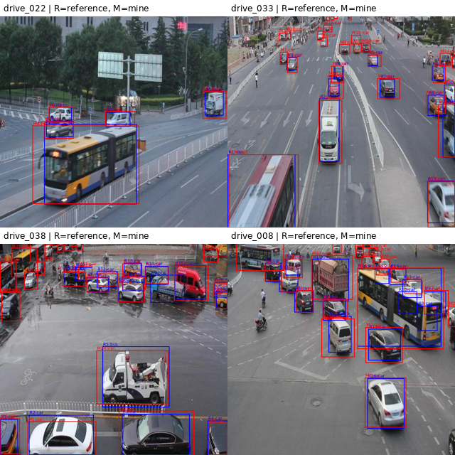

# Báo cáo --- Ngày 2: phát hiện vật thể

> `REPORT.md` này chứa trực tiếp phiếu quy tắc, bảng tóm tắt comparison
> và ảnh phủ đối chiếu.

**Họ và tên:** Nguyễn Xuân Việt Anh` `{=html}

**MSSV:** 2A202602102` `{=html}

**Hình thức:** Cá nhân` `{=html}

**Mã cặp:** `SOLO`

## 1. Bài độc lập và nguồn dữ liệu

-   Mã SHA-256 của ZIP ảnh được cấp:
    `f7d99888f21440fb0374d84962b93213bd8c14e665d093cc8d37f4c61b71ed33`
-   Bốn mã ảnh: `drive_022`, `drive_033`, `drive_038`, `drive_008`
-   Số vật thể thực tế: **96 hộp**
-   Mã SHA-256 của gói YOLO của bạn:
    `479a0f7862c17697c283f6e2c8fd49092d97aa4291ee52719cef47864a27fb6b`
-   Mã SHA-256 của gói CVAT gốc của bạn:
    `0be619f5d2b73f7aad58c198be2247d08e33f51fe21f2aad30072b5c3ca4ef87`
-   Nguồn đối chiếu: bộ nhãn đối chiếu do Lab Coach cấp
    (`teaching_reference`)
-   Mã SHA-256 của gói đối chiếu:
    `c8bbc767d8bb9a29f4ca5abf0c3516e5c2af94c58143a980b0148cfe0b500d2b`
-   Nếu làm cá nhân, ghi mã lần phát và thời điểm nhận bộ tham chiếu:
    `release_id=day2-reference-4img-v1`, nhận
    `day2-comparison-export.zip` ngày 14/09/2026.

Phân bố hộp theo ảnh:

  Ảnh             Tổng hộp      car   truck      bus     van
  ------------- ---------- -------- ------- -------- -------
  `drive_022`            5        3       1        1       0
  `drive_033`           31       28       1        2       0
  `drive_038`           34       23       0        6       5
  `drive_008`           26       19       1        3       3
  **Tổng**          **96**   **73**   **3**   **12**   **8**

Mục tiêu khối lượng 40--60 hộp **không đạt phạm vi**, vì số vật thể thực
tế là 96 hộp. Không điều chỉnh số lượng bằng cách vẽ thêm hoặc bỏ hộp
không có căn cứ.

Bài được thực hiện độc lập vì việc gán nhãn và xuất các gói YOLO/CVAT
của cá nhân được hoàn thành trước khi sử dụng nguồn đối chiếu. Kiểm tra
đầu vào chỉ kiểm tính toàn vẹn của ZIP ảnh được cấp trực tiếp, không tạo
hoặc tải ảnh mới. Sau khi khóa bài cá nhân mới chọn `teaching_reference`
do Lab Coach cấp để đối chiếu.

## 2. Quyết định phân lớp

  -----------------------------------------------------------------------
  Ảnh/vật thể       Lớp               Dấu hiệu nhìn     Quy tắc áp dụng
                                      thấy              
  ----------------- ----------------- ----------------- -----------------
  `drive_008`, xe   `bus`             Thân xe dài,      Gán `bus` khi xe
  buýt lớn bên phải                   nhiều cửa sổ,     có thân dài và
                                      dạng xe chở khách đặc trưng xe
                                      công cộng         khách/xe buýt;
                                                        không gán `van`
                                                        chỉ vì góc nhìn
                                                        nghiêng

  `drive_008`, xe   `truck`           Có cabin và       Gán `truck` khi
  tải ben gần giữa                    thùng/ben chở     có khoang chở
  phía trên                           hàng rõ ràng phía hàng hoặc ben
                                      sau               tách biệt; không
                                                        gán `car`

  `drive_038`, xe   `van`             Thân hộp nhỏ, kín Gán `van` khi
  van đỏ bên phải                     và cao hơn ô tô   thân xe dạng hộp
                                      con               kín, không có đặc
                                                        trưng của xe buýt
                                                        dài

  `drive_033`, các  `car`             Thân xe con,      Gán `car` cho
  xe sedan/taxi                       thấp, không có    sedan, hatchback,
  trên làn đường                      thùng hàng hoặc   SUV, taxi hoặc xe
                                      thân xe buýt      con tương tự
  -----------------------------------------------------------------------

Lớp và thuộc tính là hai loại thông tin khác nhau. Ví dụ, một xe buýt
vẫn có lớp `bus`, nhưng thuộc tính `visibility` có thể là `occluded` nếu
bị xe khác che một phần; `boundary` có thể là `truncated` nếu xe bị mép
ảnh cắt; `review_state` có thể là `needs_review` nếu chưa đủ bằng chứng
để quyết định. Lớp mô tả **loại phương tiện**, còn thuộc tính mô tả
**trạng thái quan sát và mức cần kiểm tra**.

Ba tình huống mơ hồ cần áp dụng thống nhất: 1. **Xe bị che một phần:**
chỉ vẽ theo phần phương tiện có thể xác định, đồng thời dùng
`visibility=occluded` khi phù hợp. 2. **Xe bị mép ảnh cắt:** giữ hộp
theo phần nhìn thấy và dùng `boundary=truncated`. 3. **Xe quá nhỏ/xa
hoặc khó phân biệt `car`/`van`/`bus`:** không đoán để đạt số lượng; dùng
`review_state=needs_review` và xin Lab Coach hỗ trợ khi chưa đủ bằng
chứng.

## 3. Tự kiểm tra và sửa nhãn

  ----------------------------------------------------------------------------
  Trước khi sửa     Loại lỗi          Cách phát hiện    Sau khi sửa và quy tắc
  ----------------- ----------------- ----------------- ----------------------
  Một số xe ở mép   phạm vi/hình học  Rà từng ảnh ở mức Chỉ giữ hộp sát phần
  ảnh hoặc bị che                     phóng to và kiểm  phương tiện nhìn thấy;
  có nguy cơ bị vẽ                    tra hộp có bao    xe bị mép ảnh cắt được
  rộng theo phần                      phần không nhìn   đánh dấu
  suy đoán                            thấy hay không    `boundary=truncated`

  Một số xe thân    lớp               So lại chiều dài  `van` cho thân hộp nhỏ
  hộp nhỏ dễ nhầm                     thân, cửa sổ,     kín; `bus` cho thân
  `van` với `bus`                     khoang hàng và    dài có đặc trưng xe
  hoặc `car`                          hình dáng tổng    chở khách; `car` cho
                                      thể               xe con không có các
                                                        đặc trưng trên

  Một số hộp cần    thuộc tính        Audit CVAT đối    Cả ba thuộc tính đều
  kiểm tra lại                        với `visibility`, có đủ 96/96 giá trị
  thuộc tính                          `boundary`,       trong gói CVAT gốc
                                      `review_state`    
  ----------------------------------------------------------------------------

-   Số hộp `needs_review` trước và sau khi kiểm: **Đã xử lý mọi hộp
    `needs_review`; report không có thống kê riêng số hộp trước/sau
    kiểm.**
-   Một quyết định chưa đủ bằng chứng và cách bạn xin hỗ trợ: với phương
    tiện nhỏ, xa hoặc bị che nhiều, đánh dấu
    `review_state=needs_review`, ghi rõ lý do và hỏi Lab Coach thay vì
    tự đoán lớp hoặc vẽ thêm hộp để đủ số lượng.

## 4. Một dòng nhãn YOLO

-   Dòng `class x_center y_center width height`:
    `0 0.270039 0.504586 0.109703 0.065828`
-   Tên lớp và tọa độ điểm ảnh `xyxy`: `0 = car`; tâm chuẩn hóa
    `(0.270039, 0.504586)`; kích thước chuẩn hóa `(0.109703, 0.065828)`;
    tọa độ pixel `xyxy = [137.7, 301.9, 207.9, 344.0]`.
-   Vì sao dòng đúng định dạng vẫn có thể sai lớp, phạm vi hoặc hình
    học?

Dòng YOLO đúng cú pháp chỉ chứng minh có đủ năm trường và giá trị có thể
đọc được. Nó vẫn có thể sai về ngữ nghĩa: sai lớp nếu phương tiện bị gán
nhầm, sai phạm vi nếu hộp bao quá rộng hoặc vượt vùng hợp lệ, hoặc sai
hình học nếu tâm/kích thước không khớp vật thể trong ảnh. Vì vậy cần đối
chiếu label với ảnh gốc và quy tắc annotation, không chỉ kiểm tra định
dạng file.

## 5. Huấn luyện và dự đoán thử

-   Ba mã ảnh huấn luyện: `drive_022`, `drive_033`, `drive_038`

-   Mã ảnh thẩm định: `drive_008`

-   Mô hình: `yolo11n.pt`

-   Môi trường: Ultralytics `8.4.145`, Python `3.13.15`, PyTorch
    `2.11.0+cu128`

-   Thiết bị: GPU CUDA `0`, Tesla T4 14913 MiB

-   Cấu hình chính: 8 epoch, seed 42, ảnh 640, batch 4, `freeze=10`,
    `patience=3`

-   Kết quả chạy: dừng sớm ở epoch 4; best model ở epoch 1

-   Thời gian chạy: 53.0 giây

-   SHA-256 mô hình:
    `0ebbc80d4a7680d14987a577cd21342b65ecfd94632bd9a8da63ae6417644ee1`

-   Mô tả một dự đoán trong `detect_result.jpg`: ảnh thẩm định là
    `drive_008`. Ảnh có một xe buýt lớn ở phía bên phải, nhiều xe con,
    xe tải và các phương tiện nhỏ ở xa. Kết quả dự đoán được dùng để
    kiểm tra khả năng mô hình nhận diện các phương tiện có kích thước và
    mức độ che khuất khác nhau.

-   Dự đoán đó gợi ý cần kiểm lại quy tắc hoặc dữ liệu nào? Cần kiểm lại
    cách xử lý vật thể nhỏ/xa, xe bị che, phân biệt `van` với `car`, và
    độ chặt của bounding box.

-   Minh chứng nào có thể bác bỏ nhận định của bạn? Ảnh gốc kèm
    annotation đúng, bảng đối chiếu với `teaching_reference`, hoặc các
    dòng YOLO/CVAT cho thấy class và geometry của object đã được xác
    định khác với nhận định từ prediction.

-   Vì sao kết quả trên bốn ảnh không phải phép đánh giá mô hình dùng
    thực tế? Vì tập chỉ có 4 ảnh, kích thước mẫu rất nhỏ và có thể có
    cùng bối cảnh/thời gian; kết quả chủ yếu dùng để kiểm tra pipeline
    dữ liệu và prediction thử, không đủ để kết luận khả năng tổng quát
    hoặc chất lượng triển khai thực tế.

## 6. Đối chiếu nhãn

Kết quả comparison mới nhất được lấy từ bộ xuất đối chiếu
`teaching_reference`.

-   **Phương pháp matching:** ghép tối ưu theo IoU hình học, **không
    dùng class khi ghép**.
-   **Comparison IoU floor:** `0.01`.
-   `0.01` **không phải ngưỡng đạt/rớt chính thức**; đây chỉ là floor
    được sử dụng trong phép so sánh/matching.
-   **Số hộp được ghép:** 47.
-   **Mean IoU:** `0.771984`.
-   **Median IoU:** `0.794686`.
-   **Class agreement:** `74.4681%` (xấp xỉ `74.47%`).
-   **Box phía bạn không ghép:** 49.
-   **Box phía comparison không ghép:** 3.
-   **Nguồn comparison:** `teaching_reference`.
-   **SHA-256 của comparison export:**
    `c8bbc767d8bb9a29f4ca5abf0c3516e5c2af94c58143a980b0148cfe0b500d2b`.

> **Cảnh báo diễn giải:** Bộ nhãn đối chiếu hỗ trợ phản hồi sau bài làm
> độc lập; đây không phải kết luận chất lượng sản xuất.

### Tóm tắt kết quả comparison mới nhất

  Chỉ số                                                       Kết quả
  --------------------------- ----------------------------------------
  Box phía bạn                                                  **96**
  Box comparison                **không được cung cấp trong JSON mới**
  Matched boxes                                                 **47**
  Unmatched phía bạn                                            **49**
  Unmatched phía comparison                                      **3**
  Mean IoU                                                **0.771984**
  Median IoU                                              **0.794686**
  Class agreement                                         **74.4681%**

JSON comparison mới chỉ cung cấp số liệu tổng hợp, không cung cấp bảng
phân rã theo từng ảnh hoặc confusion matrix tương ứng. Vì vậy các bảng
per-image/confusion matrix của phiên bản comparison cũ không được dùng
làm số liệu của kết quả mới để tránh trộn hai lần chạy với phương pháp
matching khác nhau.

### Minh chứng cho phiếu quy tắc

  -----------------------------------------------------------------------
  Tình huống mơ hồ                    Quy tắc quyết định
  ----------------------------------- -----------------------------------
  Xe bị che một phần                  Giữ bounding box theo phần phương
                                      tiện quan sát được; dùng
                                      `visibility=occluded` khi phù hợp.

  Xe bị cắt bởi mép ảnh               Giữ bounding box theo phần nhìn
                                      thấy; dùng `boundary=truncated`.

  Xe quá nhỏ/xa hoặc khó phân biệt    Không đoán để đạt chỉ tiêu; dùng
  `car`/`van`/`bus`                   `review_state=needs_review` và xin
                                      Lab Coach hỗ trợ khi chưa đủ bằng
                                      chứng.
  -----------------------------------------------------------------------

### Minh chứng cho tóm tắt, bảng và ảnh phủ đối chiếu

**Tóm tắt:** 96 box phía cá nhân; kết quả comparison mới nhất có 47 box
được ghép, 49 box phía cá nhân không ghép và 3 box phía comparison không
ghép; mean IoU = 0.771984; median IoU = 0.794686; class agreement =
74.4681%. Comparison IoU floor = 0.01 và không phải ngưỡng đạt/rớt chính
thức.

**Bảng comparison theo ảnh:** JSON mới không cung cấp breakdown theo
từng `image_id`, nên không tái sử dụng bảng per-image của lần comparison
cũ.

**Ảnh phủ đối chiếu:** ảnh được nhúng trực tiếp bên dưới để file
`REPORT.md` tự chứa minh chứng, không phụ thuộc file ảnh riêng.

`

## 7. Kiểm tra kho GitHub cá nhân

-   [x] Có phiếu quy tắc với ba tình huống mơ hồ.
-   [x] Có kết quả kiểm hai gói xuất.
-   [x] Có thông tin lần huấn luyện và ảnh dự đoán.
-   [x] Có tóm tắt, bảng và ảnh phủ của bước đối chiếu.
-   [x] Không có gói xuất thô, bộ nhãn tham chiếu hoặc trọng số mô hình.
-   [x] Không có dữ liệu VinFast/khách hàng/ảnh cá nhân/mật khẩu/mã truy
    cập.

**Minh chứng mạnh nhất trong bài và câu hỏi còn lại cho Lab Coach:**

Minh chứng mạnh nhất là gói CVAT gốc có 96 object và đủ ba thuộc tính
bắt buộc `visibility`, `boundary`, `review_state` với 96/96 giá trị;
đồng thời YOLO và CVAT của cá nhân có cùng trạng thái annotation với 96
box và IoU hình học nhỏ nhất `0.9998893471777134`, cao hơn ngưỡng kiểm
tra `0.995`.

Câu hỏi còn lại cho Lab Coach là: **vì sao annotation cá nhân có 96
object trong khi `teaching_reference` chỉ có 50 object, và khi matching
object-level thì các object không ghép được được xem là over-annotation,
reference omission hay khác biệt về phạm vi gán nhãn?**
